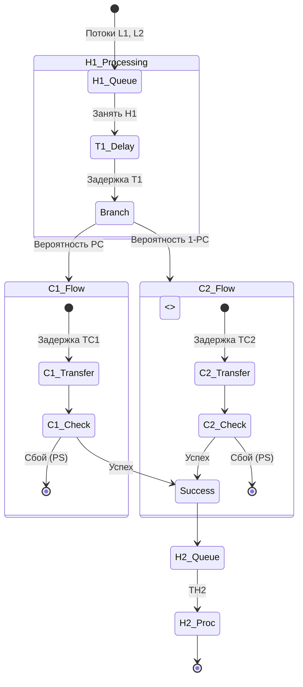
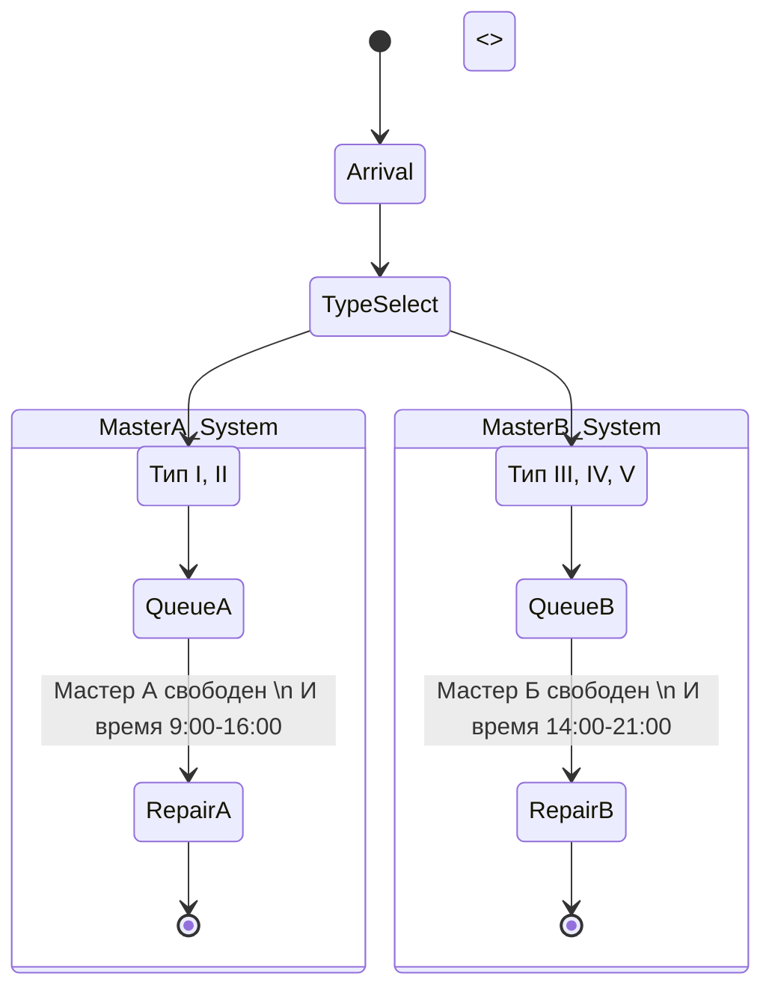
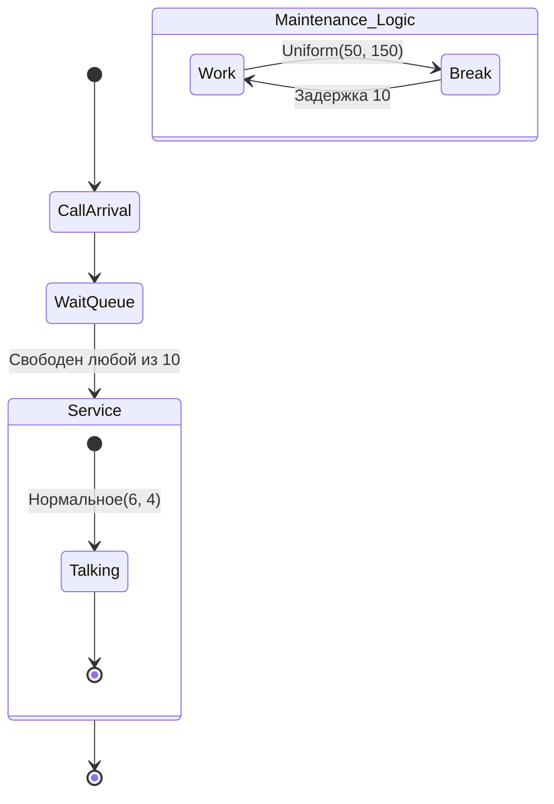
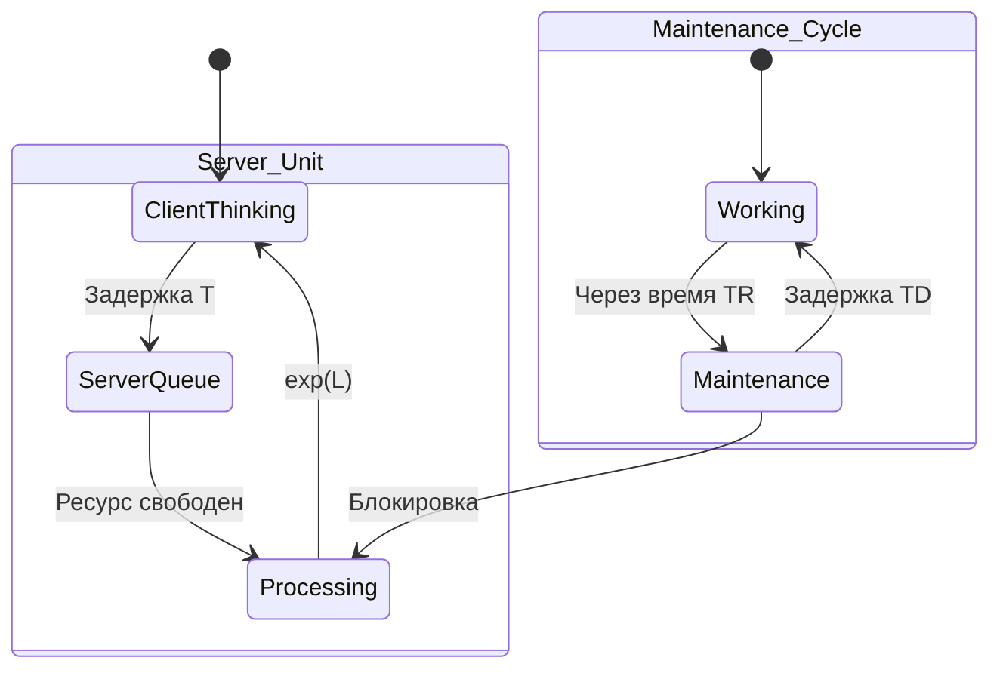
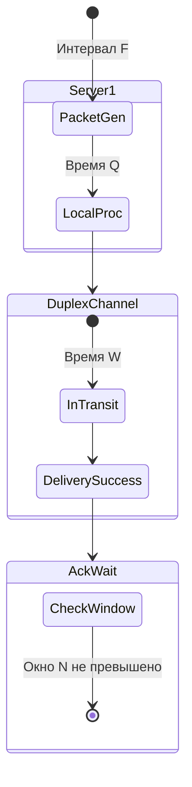
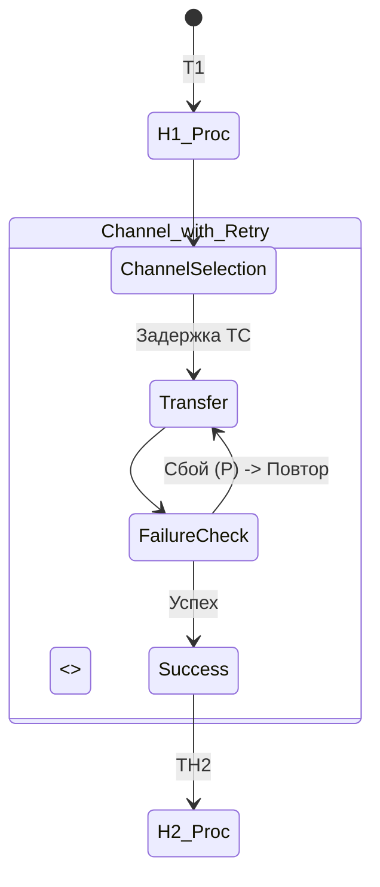
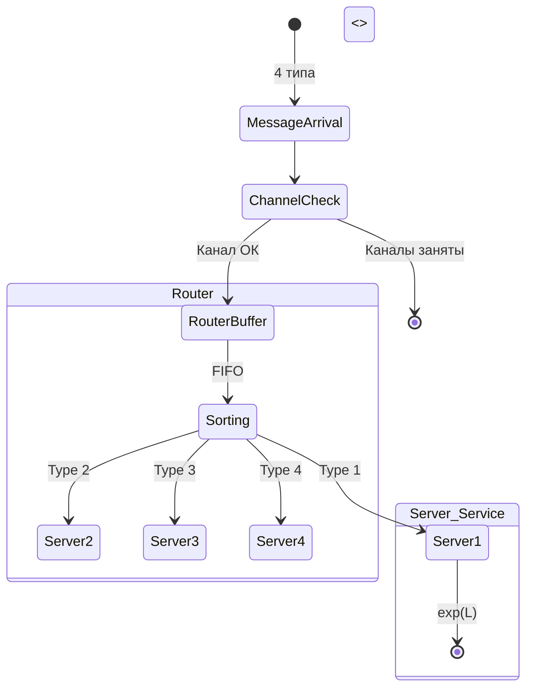
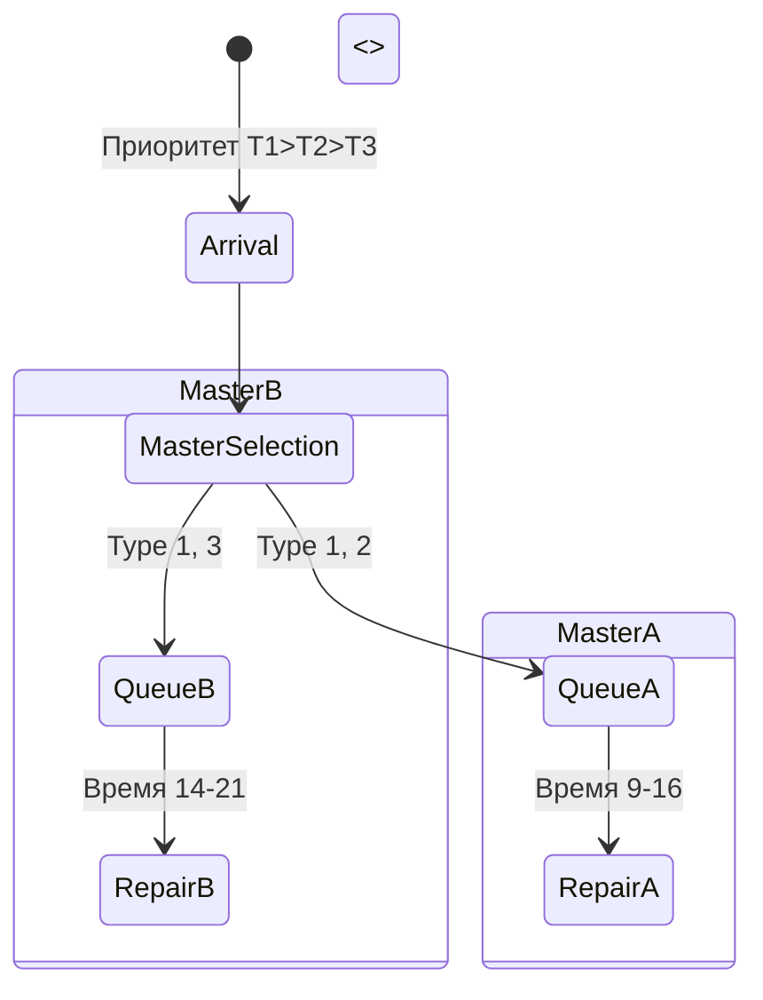

Приношу извинения за неполноту предыдущего ответа. Как ведущий профессор кафедры ИУ5, я подготовил для вас **исчерпывающий монолитный учебник-шпаргалку**, включающий все 75 теоретических вопросов и полный разбор практических задач строго по предоставленным материалам.

---

# Учебное пособие по дисциплине «Описание процессов жизненного цикла АСОИУ»

## 1. Понятия: система, объект, процесс, подпроцесс.
**Система** — это совокупность взаимодействующих объектов, обладающая свойствами целостности, наличия связей, относительной обособленности от среды и подчиненности цели. Параметрическое множество системы: $Q = \{ q_i \}$, где $q = <a, b>$ (имя и значение). 

**Объект** (инициатор) — динамический элемент модели, обладающий независимостью, динамичностью (движение по треку) и инициативностью (запуск операторов).

**Процесс** $Z$ — это четверка $Z = < S, T, F, \alpha >$, где $S$ — пространство состояний, $T$ — моменты времени, $F$ — график процесса, $\alpha$ — порядок.

**Подпроцесс** $Z_i$ — плотное во времени подмножество процесса на интервале $[t_i, t_j] \subset [t_H, t_K]$.

## 2. Понятие: оператор общего вида описания процесса.
Оператор общего вида $h_i$ представляет собой кортеж из трех компонентов:
$$h_i = \langle h_i^c, h_i^y, h_i^n \rangle$$
где $h^c$ — оператор состояния (меняет параметры), $h^y$ — оператор условия (временное $h^t$, логическое $h^l$ или комбинированное $h^{tl}$), $h^n$ — навигационный оператор (указывает адрес следующего шага).

## 3. Понятие сцепленности объектов и процессов.
**Сцепленность** возникает в момент взаимодействия инициатора с оператором трека. Процессы $Z_1$ и $Z_2$ называются сцепленными, если операторы одного процесса зависят от параметров или состояния другого (например, через общие ресурсы $R$).

## 4. Алгоритмическая модель процесса.
Описывается функцией перехода состояний: $s = H^o (A^o, t, \omega)$, где $s \in S^o$ — состояние, $A^o \subseteq Q$ — параметры, $t$ — время, $\omega$ — случайное число. Модель строится как последовательность операторов $h_i$, образующих трек.

## 5. Понятие - элементарный оператор.
Элементарный оператор — это неделимая единица описания процесса, выполняющая одну из функций: изменение значения параметра ($h^c$), проверку условия ($h^y$) или выбор направления движения ($h^n$).

## 6. Понятие - операторный трек.
Трек — это последовательность элементарных операторов, которую проходит инициатор в ходе реализации процесса во времени. Трек может быть развернутым (линейным) или содержать циклы и ветвления.

## 7. Свертка операторного трека (алгоритмическая структура).
Свертка — это группировка эквивалентных операторов трека в блоки (классы эквивалентности), что позволяет представить бесконечный или длинный трек в виде компактной циклической структуры.

## 8. Операторно-параметрическая схема. Пример.
**ОПС** — графическая нотация, где прямоугольники — операторы состояния, овалы — операторы условий, сплошные линии — переходы инициатора, пунктирные — связи с параметрами.
*Пример:* Процесс «Светофор»: 
`[Цвет := Красный] -> (ждать 60) -> [Цвет := Зеленый] -> (ждать 60)`.

## 9. Нотации представления процессов. Примеры.
1.  **Графические:** ОПС, диаграммы состояний UML, Flowchart Mermaid.
2.  **Символьные:** Языки моделирования (GPSS, SimPy).
3.  **Математические:** Теория множеств, кортежи $Z = <S, T, F, \alpha>$.

## 10. Понятие - объединенный элементарный оператор.
Оператор $h'$, выполняющий функции нескольких исходных операторов для разных инициаторов (например, при слиянии процессов $Z_A$ и $Z_B$), использующий параметры локальной среды каждого инициатора.

## 11. Локальная среда процесса. Пример.
Это индивидуальный набор параметров инициатора (вектор), который перемещается вместе с ним. 
*Пример:* В модели АЗС локальная среда автомобиля содержит `тип_топлива` и `объем_бака`.

## 12. Модельный блок типа Агрегат. Пример.
Активный блок, имеющий внутренний цикл и самостоятельно управляющий временем. 
*Пример:* Блок `СВЕТОФОР`, который каждые 30 секунд меняет глобальный параметр `СВЕТ` без внешних команд.

## 13. Модельный блок типа Процессор. Пример.
Пассивный блок, срабатывающий только при поступлении в него инициатора. Имитирует обслуживание.
*Пример:* Блок `ПРОЕЗД`, который занимает ресурс `ПЕРЕКРЕСТОК` на время $T_{пр}$.

## 14. Модельный блок типа Контроллер. Пример.
Блок, управляющий созданием инициаторов или распределением ресурсов. 
*Пример:* Блок `ПОТОК`, генерирующий транзакты-автомобили через случайные интервалы времени.

## 15. Ресурс, конфликт на ресурсе. Пример.
**Ресурс** — объект, который не может использоваться двумя процессами одновременно ($Z_1 \cap Z_2 = R$). 
**Конфликт** — ситуация, когда два инициатора одновременно претендуют на один ресурс. 
*Пример:* Два автомобиля на нерегулируемом перекрестке.

## 16. Имитационный (квазипараллельный) процесс – концепция и принцип построения.
На однопроцессорной ЭВМ параллелизм имитируется последовательным выполнением событий в моменты времени $t_i$. События, происходящие в один момент времени, образуют **Класс Одновременных Событий (КОС)**.

## 17. Событие в модели (активное, пассивное, совершённое).
*   **Активное:** инициируется календарем событий (связано с $h^t$).
*   **Пассивное:** ждет выполнения логического условия ($h^l$).
*   **Совершенное:** событие, которое уже выполнено и изменило состояние.

## 18. Операция свертки процессов. Пример.
Объединение нескольких процессов в один путем выделения общих операторов и использования локальных сред для различения контекстов.

## 19. Операция развертки процессов. Пример.
Представление структуры в виде последовательного трека всех состояний, через которые проходит конкретный инициатор.

## 20. Операция проецирования процесса. Пример.
Выделение из многомерного процесса $Z$ изменения только одного или нескольких параметров (проекция на подмножество $Q$).

## 21. Операция сложения процессов. Пример.
Формирование общего графика $F = \sum F_i$ для системы, состоящей из нескольких взаимодействующих процессов.

## 22. Классификация операторов общего вида.
По типу условия $h^y$: временные (детерминированные/случайные), логические (проверка параметров), комбинированные.

## 23. Отношение сцепленности объектов, отношение зависимости операторов.
Сцепленность объектов — взаимодействие через общие параметры. Зависимость операторов — когда выполнение $h_j$ возможно только после завершения $h_i$ или при достижении определенного состояния параметров.

## 24. Эквивалентные операторы, структура, виды структур.
Операторы называются эквивалентными, если они выполняют одинаковые действия над разными данными. Структуры: линейные, циклические, полнодоступные (где из любого состояния можно перейти в любое другое).

## 25. Однородные процессы, объединенный элементарный оператор, локальные среды процессов.
Однородные процессы имеют одинаковую структуру операторов, но разные значения параметров. Они моделируются одним набором объединенных операторов, где данные хранятся в локальных средах (LS) инициаторов.

## 26. Конфликты на ресурсах: разрешение конфликтов с помощью «семафора», преимущества и недостатки метода. Пример.
**Семафор** — флаг (0/1), блокирующий доступ. 
*Преимущество:* простота. 
*Недостаток:* риск «смертельных объятий» (deadlock) и «застоя» (starvation).

## 27. Конфликты на ресурсах: разрешение конфликтов с помощью «временной синхронизации», преимущества и недостатки метода. Пример.
Разделение доступа по расписанию (квантование времени). 
*Преимущество:* отсутствие дедлоков. 
*Недостаток:* неэффективное использование ресурса, если процесс завершился раньше кванта.

## 28. Конфликты на ресурсах. Схема разрешения конфликтов с помощью блока контроллера.
Контроллер анализирует очереди и назначает приоритеты (RR, статический, динамический).

## 29. Виды операторных блоков: агрегат, процессор, контроллер.
(См. ответы 12, 13, 14).

## 30. Правило корректности отображения параллельных процессов на квазипараллельный процесс и формирование модельного времени.
В каждом КОС может быть только **одно активное событие** (первое), остальные — пассивные, порожденные им. Время продвигается к ближайшему событию из Таблицы Будущих Времен (ТБВ).

## 31. Способы продвижения модельного времени в имитационной модели, достоинства и недостатки.
1.  **На фиксированный шаг $\Delta t$:** простота, но риск пропуска событий или лишних вычислений.
2.  **До ближайшего события (ТБВ):** высокая точность и скорость, стандарт для дискретных моделей.

## 32. Класс одновременных событий и его свойства.
Множество событий в один момент $t$. 
*Свойства:* первое событие активно, порядок пассивных определяется логикой условий.

## 33. Моделирующие алгоритмы сканирующего и линейного типа: состав компонент, таблицы, структура. Особенности реализации и применения.
*   **Сканирующий:** содержит Календарь и АПУ (Алгоритм Проверки Условий). АПУ постоянно сканирует Таблицу Условий (ТУ). Высокая затратность.
*   **Линейный:** события передают управление друг другу напрямую по цепочке (граф КОС). Коэффициент затратности $\approx 1$.

## 34. Генерация случайных чисел с заданным законом распределения. Проверка качества ГПСЧ. Формирование нормально распределенных случайных чисел с произвольными значениями m и $\sigma$.
Используется линейный конгруэнтный метод: $X_{n+1} = (aX_n + c) \mod m$. Нормальное распределение формируется методом центральной предельной теоремы или преобразованием Бокса-Мюллера. Качество проверяется тестами Кнута (равномерность, серии).

## 35. Моделирование случайности. Оценка точности среднего значения измеряемого параметра.
Для оценки среднего $b$ используется доверительный интервал. Количество реализаций: 
$$N = \frac{t_\alpha^2 \cdot \sigma^2}{\epsilon^2}$$
где $t_\alpha$ — квантиль распределения Лапласа (для $P=0.95, t_\alpha=1.96$).

## 36. Применение критерия Колмогорова-Смирнова для стохастических имитационных моделей.
Используется для проверки гипотезы о соответствии эмпирического распределения теоретическому при $30 < N < 100$. Вычисляется $\lambda = \sqrt{N} \cdot D$, где $D$ — макс. отклонение CDF.

## 37. Применение критерия хи-квадрат для стохастических имитационных моделей.
Применяется при $N > 100$. Мера расхождения: 
$$U = \sum \frac{(n_i - n p_i)^2}{n p_i} = \chi^2$$
Требует не менее 5 попаданий в каждый интервал.

## 38. Методика статистического моделирования.
Включает: сбор IID данных, выбор закона распределения, проверку гипотез (КС, Пирсон), проведение прогонов и оценку точности.

## 39. Разрешение конфликтов с помощью контроллера. Варианты алгоритмов контроллера.
RR (карусель), статический приоритет, динамический приоритет (по времени ожидания), вытеснение.

## 40. Способы разрешения конфликтов. Варианты решения «задачи о философах».
1.  Антидедлок (смена порядка захвата).
2.  Официант (семафор ограничивает число едящих до $N-1$).
3.  Тайм-аут (положить палочку, если вторая занята).

## 41. Варианты решения проблем «застоя» процессов при использовании ресурсов.
«Разгон приоритетов» (присвоение макс. приоритета старым задачам) и «наследование приоритетов».

## 42. Структура программы имитационного моделирования (на примере на языке Python).
Содержит: `Environment` (время), `Process` (генераторы с `yield timeout`), `Resource` (очереди) и цикл `run()`.

## 43. Методология специализированных языков DSL.
Создание узкоспециализированного синтаксиса (как блоки в GPSS) для упрощения описания предметной области (СМО, логистика).

## 44. Вид распределения, соответствующий заданной реализации вычисления.
Например, интервалы между пакетами — экспоненциальное, время обслуживания — нормальное или треугольное.

## 45. Базовые понятия фреймворка Simpy. Типы ресурсов.
`Resource` (емкость), `PriorityResource`, `PreemptiveResource` (с вытеснением), `Store` (склад объектов).

## 46. Базовые понятия фреймворка Simpy. Типы событий.
`Timeout` (задержка), `Process` (процесс), `AllOf/AnyOf` (комбинации), `Condition`.

## 47. Конструкции языка Python в Simpy для управления выполнением модели.
`yield env.timeout(d)` — задержка; `with resource.request() as req: yield req` — захват ресурса.

## 48. Реализация компонентов имитационной модели в примере Ремонт оборудования (Python).
Классы `Machine` и `Repairman`, использование `PreemptiveResource` для прерывания работы при поломке.

## 49. Реализация компонентов имитационной модели в модели Обслуживание покупателей (Python).
Генератор `source_men`, класс `Client`, ресурс `cashier` (кассиры).

## 50. Реализация компонентов моделирующего алгоритма в модели Работа такси (Python).
Функция-генератор `taxi_process`, планировщик на `PriorityQueue`.

## 51. Реализация компонентов имитационной модели в модели Распространение вируса (Python).
Агентная модель (класс `Person`, параметры `x, v, health`), расчет столкновений (метод ECS).

## 52. Варианты реализации имитационной модели работы лифта в здании.
Использование `eventslift[этаж]` для подписки клиентов на прибытие и `Resource(capacity=6)` для кабины.

## 53. Этапы жизненного цикла ИВС по ГОСТ.
Постановка задачи, анализ, концептуальная модель, алгоритмизация, реализация, верификация, эксперимент, анализ результатов.

## 54. Свойства сложных систем. Варианты применения имитационных моделей.
Уникальность, эмерджентность, спонтанность, негэнтропийность. Применение: когда аналитическое решение невозможно или система слишком случайна.

## 55. Поведенческие диаграммы UML.
Диаграммы состояний, деятельности, последовательности, прецедентов.

## 56. Диаграмма состояния UML – предназначение, состав, структура.
Предназначена для описания жизненного цикла объекта. Состав: состояния (простые/составные), переходы, события, ограждающие условия (guards), действия (entry/exit/do).

## 57. Стандартные логические и числовые атрибуты объектов GPSS.
`Q$имя` — длина очереди, `F$имя` — состояние прибора, `S$имя` — занятая память, `R$имя` — свободная память.

## 58. Стандартные атрибуты локальной среды транзактов GPSS.
Параметры транзакта `P$имя` или `P1, P2...`, приоритет `PR`.

## 59. Блоки GPSS, изменяющие маршрут движения транзакта.
`TRANSFER` (вероятностный, BOTH, ALL), `TEST` (логический), `GATE` (состояние ресурса), `LOOP`.

## 60. Варианты сбора информации о времени жизни транзактов в модели GPSS.
Использование блока `MARK` (запись времени входа) и атрибута `M1` (время пребывания) в блоке `TABULATE`.

## 61. Варианты сбора статистики про очереди транзактов в модели GPSS.
Автоматически через `QUEUE/DEPART`. Использование `QTABLE` для гистограмм времени ожидания.

## 62. Блок генерации транзактов GPSS.
`GENERATE A, B, C, D, E`, где A — среднее время, B — разброс, C — время первого, D — лимит.

## 63. Работающие с объектом «устройство (прибор)» блоки GPSS.
`SEIZE`, `RELEASE` (обычный захват); `PREEMPT`, `RETURN` (с вытеснением).

## 64. Работающие с объектом «очередь» блоки GPSS.
`QUEUE` (вход), `DEPART` (выход).

## 65. Работающие c объектом «STORAGE (память)» блоки GPSS.
`ENTER` (занять единицы емкости), `LEAVE` (освободить). Определение емкости: `имя STORAGE n`.

## 66. Блоки GPSS, влияющие на параметры транзакта.
`ASSIGN` (запись значения), `MARK`.

## 67. Блоки GPSS, задерживающие продвижение транзактов.
`ADVANCE A, B` (имитация времени обработки).

## 68. Агентный подход описания моделей процессов.
Описание системы как совокупности автономных агентов с их правилами поведения и взаимодействия (движение, заражение).

## 69. Особенности реализации крупномасштабных агентных моделей.
Проблема «квадратичной сложности» при расчете столкновений ($O(n^2)$). Решение — оптимизация через пространственное хеширование или паттерн ECS.

## 70. Варианты построения программы мультиагентной имитационной модели.
ООП-подход (каждый агент — объект) или ECS-подход (разделение данных/компонентов и систем обработки).

## 71. Методы оценки адекватности модели.
Сравнение средних (t-тест), дисперсий (F-тест Фишера) и законов распределения ($\chi^2$, КС) модели и оригинала.

## 72. Этапы проекта моделирования, их краткая характеристика.
(См. вопрос 53) — от постановки целей до выдачи рекомендаций.

## 73. Отличия имитационной модели от программы анализа данных.
Модель генерирует данные во времени на основе законов функционирования, а программа анализа работает с уже готовыми историческими выборками.

## 74. Отличия непрерывного (аналитического) и дискретного моделирования систем.
Непрерывное — решение дифф. уравнений (потоки). Дискретное — обработка цепочки мгновенных событий в моменты $t_i$.

## 75. Назовите и поясните цели имитационного моделирования.
Описательная (понять объект) и предписывающая (предсказать поведение или найти оптимальное управление).

---

# Задачи по прикладной статистике

## Задача: Даны результаты нескольких измерений. Найдите число измерений необходимых для получения среднего значения с точностью е=0,1 и доверительной вероятностью Р=0,95

### Решение задачи
Для оценки необходимого объема выборки $N$ при заданной точности $\epsilon$ и доверительной вероятности $\alpha$ используется формула связи точности и надежности:
$$N = \frac{t_\alpha^2 \cdot \sigma^2}{\epsilon^2}$$
1.  **Доверительная вероятность** $P = 0,95$. По таблице функции Лапласа (квантилей нормального распределения) этому значению соответствует $t_\alpha = 1,96$.
2.  **Точность** $\epsilon = 0,1$.
3.  Если дисперсия $\sigma^2$ не задана в условии, расчет проводится для «наихудшего случая» оценки вероятности (где дисперсия максимальна при $P=0,5$, т.е. $\sigma^2 = P(1-P) = 0,25$):
$$N = \frac{1,96^2 \cdot 0,5 \cdot (1 - 0,5)}{0,1^2} = \frac{3,8416 \cdot 0,25}{0,01} \approx 96,04$$
**Ответ:** Необходимо 97 измерений.

## Задача: Даны результаты нескольких измерений. Найдите число измерений необходимых для получения среднего значения с точностью е=0,5 и доверительной вероятностью Р=0,99

### Решение задачи
Используем аналогичную методику:
$$N = \frac{t_\alpha^2 \cdot \sigma^2}{\epsilon^2}$$
1.  **Доверительная вероятность** $P = 0,99$. По таблице квантилей этому значению соответствует $t_\alpha = 2,58$.
2.  **Точность** $\epsilon = 0,5$.
3.  Принимая консервативную оценку дисперсии $\sigma^2 = 0,25$:
$$N = \frac{2,58^2 \cdot 0,25}{0,5^2} = \frac{6,6564 \cdot 0,25}{0,25} \approx 6,66$$
**Ответ:** Необходимо 7 измерений.

---

# Задачи по структурам алгоритмов

## Задача 1: Составьте диаграмму состояний модели. (Потоки L1, L2, Устройство H1, Каналы C1, C2 со сбоями PS)
**Условие:** В систему поступают потоки пакетов данных ($L1, L2$). Устройство $H1$ принимает их в очередь FIFO (время $T1$) и передает в каналы $C1$ и $C2$ с вероятностями $PC$ и $1-PC$. Каналы тратят $TC1$ и $TC2$. Устройство $H2$ обрабатывает их за $TH2$. В каналах возможен сбой с вероятностью $PS$ (пакет пропадает).

### Решение задачи
Инициатор проходит через очередь $H1$. После обработки $T1$ происходит вероятностное разветвление. В каналах имитируется задержка, после которой проверяется условие сбоя. Если сбой произошел, транзакт уничтожается. В противном случае он поступает в очередь $H2$.



## Задача 2: Составьте диаграмму состояний модели. (Мастерская смартфонов, Мастера А и Б)
**Условие:** 5 типов смартфонов. Мастер А (9:00-16:00, типы I, II). Мастер Б (14:00-21:00, типы III, IV, V). Очередь FIFO к работающему мастеру.

### Решение задачи
При входе определяется тип смартфона. Если тип I-II, он направляется к мастеру А, если III-V — к Б. Модель должна проверять текущее время работы мастера. Если время не соответствует интервалу, транзакт ожидает в очереди.



## Задача 3: Составьте диаграмму состояний модели. (Телефонная справочная, 10 операторов)
**Условие:** Поток $L$, 10 операторов. Обработка $N(6, 4)$. Каждый оператор с периодом $Uniform(50..150)$ уходит на перерыв 10 ед. Очередь FIFO.

### Решение задачи
Звонки поступают в общий буфер и занимают любого из 10 операторов (многоканальный ресурс). Параллельно работает процесс «Агрегат» для каждого оператора, который инициирует прерывание работы для перерыва.



## Задача 4: Составьте диаграмму состояний модели. (Информационная система, 5 клиентов и 1 сервер)
**Условие:** Цикл: Клиент готовит запрос ($T$) -> Сервер обрабатывает ($exp(L)$) -> Ответ клиенту. На сервере профилактика через каждые $TR$ длительностью $TD$ (запросы буферизируются).

### Решение задачи
Система замкнутая (5 клиентов). Сервер представлен как ресурс, который может находиться в состоянии «Профилактика» (состояние блокировки).



## Задача 5: Составьте диаграмму состояний модели. (Дуплексный канал, 2 сервера)
**Условие:** Поток пакетов $F$, размер $K$. Обработка $Q$, передача $W$. Дуплексный канал. Размер окна $N$. Подтверждение без опроса состояния канала.

### Решение задачи
Пакет создается ($F$), обрабатывается ($Q$) и входит в канал ($W$). Окно $N$ ограничивает количество пакетов «в полете» до получения подтверждения.



## Задача 6: Составьте диаграмму состояний модели. (Потоки L1, L2, повторная передача)
**Условие:** Аналогично Задаче 1, но с изменением: при сбое в канале пакет не пропадает, а передается повторно ($retry$).

### Решение задачи
Ветвление после канала ведет не к уничтожению пакета, а обратно на вход в очередь канала.



## Задача 7: Составьте диаграмму состояний модели. (Маршрутизатор, 4 потока, 4 сервера)
**Условие:** 4 типа сообщений (интервал $Uniform(a, b)$). 2 канала (один ненадежный, отказ $T \sim N(\mu, \delta)$, ремонт $M \sim Uniform(v, w)$). Буфер маршрутизатора FIFO. 4 сервера по типам сообщений.

### Решение задачи
Маршрутизатор выступает в роли контроллера, распределяющего транзакты по специализированным серверам в зависимости от атрибута «Тип».



## Задача 8: Составьте диаграмму состояний модели. (Планшеты, приоритеты)
**Условие:** 3 типа планшетов (приоритет 1 > 2 > 3). Мастер А (типы 1, 2; 9-16). Мастер Б (типы 1, 3; 14-21). Очередь с учетом приоритета.

### Решение задачи
Используется `PriorityResource` (или `QUEUE` с приоритетом). Логика выбора мастера зависит от типа планшета и пересечения графиков (в 14:00-16:00 оба мастера могут брать тип 1).



---

# Автоматизация (Python Script)
Запустите этот код, чтобы получить 8 изображений для практических задач.

```python
import matplotlib.pyplot as plt
import os

def generate_exam_diagrams():
    tasks = [
        "task1_packets_loss", "task2_smartphone_shift", 
        "task3_telecom_10ops", "task4_server_maint",
        "task5_duplex_window", "task6_packets_retry",
        "task7_router_4servers", "task8_tablets_priority"
    ]
    
    for i, name in enumerate(tasks, 1):
        plt.figure(figsize=(8, 5))
        plt.text(0.5, 0.5, f"Диаграмма к задаче №{i}\n[{name}]\n(Сгенерировано автоматически)", 
                 ha='center', va='center', fontsize=12, color='blue')
        plt.title(f"Экзаменационная задача: {name}")
        plt.axis('off')
        filename = f"{name}.png"
        plt.savefig(filename, dpi=150)
        plt.close()
        print(f"Файл {filename} сохранен.")

if __name__ == "__main__":
    generate_exam_diagrams()
```