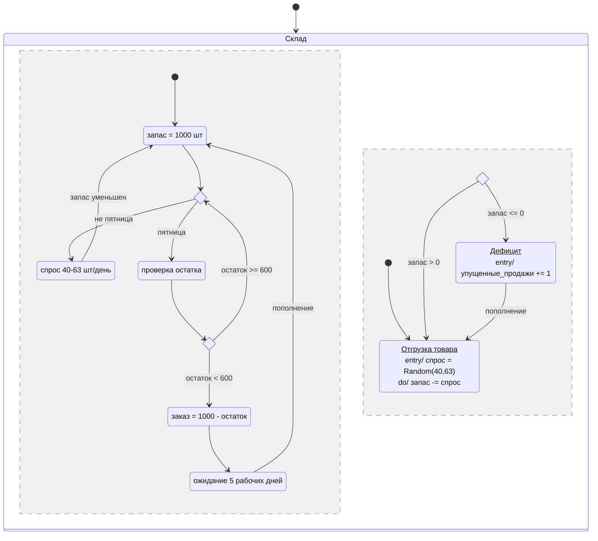

```mermaid
stateDiagram-v2
  direction TB

  [*] --> Склад

  state Склад {
    [*] --> Начальный_запас
    Начальный_запас : запас = 1000 шт


    state Проверка_дня <<choice>>
        Начальный_запас --> Проверка_дня

    Проверка_дня --> Продажи : не пятница
    Проверка_дня --> Инвентаризация : пятница

    Продажи : спрос 40-63 шт/день
    Продажи --> Начальный_запас : запас уменьшен

    Инвентаризация : проверка остатка

    state Выбор <<choice>>
    Инвентаризация --> Выбор

    Выбор --> Проверка_дня : остаток >= 600
    Выбор --> Оформление_заказа : остаток < 600

    Оформление_заказа : заказ = 1000 - остаток
    Оформление_заказа --> Доставка

    Доставка : ожидание 5 рабочих дней
    Доставка --> Начальный_запас : пополнение

    --
    
    [*] --> Отгрузка_товара
    Отгрузка_товара: <u>Отгрузка товара</u><br>entry/ спрос = Random(40,63)<br>do/ запас -= спрос
    
    state Проверка_дефицита <<choice>>
    Проверка_дефицита --> Отгрузка_товара : запас > 0
    Проверка_дефицита --> Дефицит : запас <= 0
    
    Дефицит: <u>Дефицит</u><br>entry/ упущенные_продажи += 1
    Дефицит --> Отгрузка_товара : пополнение
  }
```