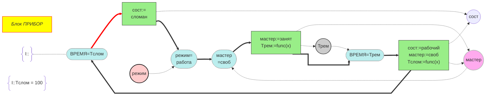

```mermaid
flowchart LR
title[<em>Блок ПРИБОР</em>]
h1(["BPEMЯ=Tслом"])==> h2["сост:=<br>сломан"]
h3 ==> h4(["мастер<br>=своб"])
h4 ==> h5["мастер:=занят<br>Tрем:=funс(x)"]
h6 ==> h7["сост:=рабочий<br>мастер:=своб<br>Tслом:=func(x)"]
h2 -.->par3((сост))
h7 -.->par3
par1((режим))-.->h3
par2((мастер))-.->h4
h5 -.->par2
h7 -.->par2
h5 -.->par4((Трем))
par4 -.-> h6
h2 e11@==> h3(["режим=<br>работа"])
h5 e20@==> h6(["ВРЕМЯ=Трем"])
h7 e10@==> h1
e10@{ curve: linear}
e11@{ curve: natural}
e20@{ curve: stepAfter}
Ini@{shape: braces, label: "I::"} -.- h1
HTf@{shape: braces, label: "I::Tслом = 100"}

classDef cond fill:#bee,stroke:#aaa,stroke-width:1px;
 classDef state fill:#9e8,stroke:#333,stroke-width:1px;
 class h5,h8,h2,h7 state;
class h1,h3,h4,h6 cond;
style title fill:yellow,stroke:red;
style par1 fill:#fcc,stroke:#111,stroke-width:2px;
style par2 fill:#fae,stroke:#bbb,stroke-width:2px;
style par4 fill:#ccc,stroke:#555,stroke-width:2px;
linkStyle 0 stroke:red,stroke-width:4px;
```