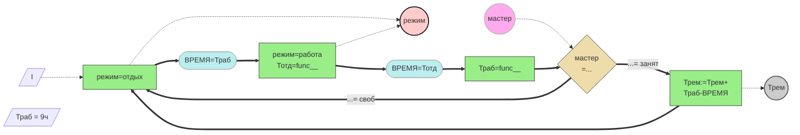

```mermaid
flowchart LR

    I[/I/] -.-> h11["режим=отдых"]
    h11 ==> h12(["ВРЕМЯ=Траб"])
    h11 -.-> par1((режим))
    h12 ==> h13["режим=работа<br>Тотд=func__"]
    h13 -.-> par1((режим))
    h13 ==> h14(["ВРЕМЯ=Тотд"])
    h14 ==> h17["Траб=func__"]
    par2((мастер)) -.->  h15
    h17 ==> h15{"мастер<br>=..."}
    h15 ==> |"...= занят"| h16["Трем:=Трем+<br>Траб-ВРЕМЯ"]
    h15 ==> |"...= своб"| h11
    h16 -.-> par4((Трем))

    h16==>h11
    h19[/Траб = 9ч/]

classDef navig fill:#eda,stroke:#333,stroke-width:1px;
class h15 navig;
classDef cond fill:#bee,stroke:#aaa,stroke-width:1px;
classDef state fill:#9e8,stroke:#333,stroke-width:1px;
class h11,h13,h17,h16 state;
class h12,h14 cond;
style par1 fill:#fcc,stroke:#111,stroke-width:2px;
style par2 fill:#fae,stroke:#bbb,stroke-width:2px;
style par4 fill:#ccc,stroke:#555,stroke-width:2px;
```