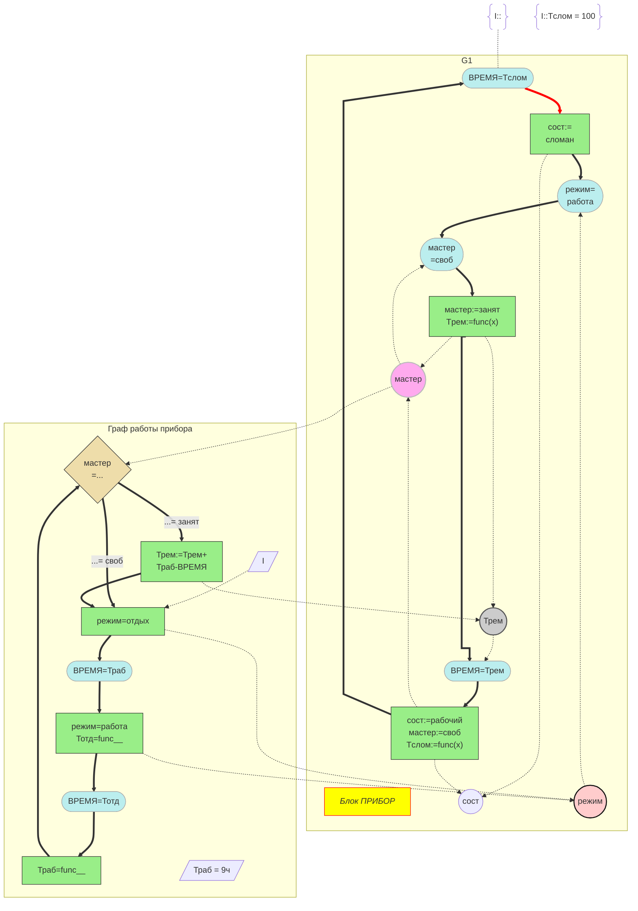

```mermaid
flowchart TD

subgraph G1
direction TB

title[<em>Блок ПРИБОР</em>]

h1(["BPEMЯ=Tслом"]) ==> h2["сост:=<br>сломан"]

h3 ==> h4(["мастер<br>=своб"])
h4 ==> h5["мастер:=занят<br>Tрем:=func(x)"]

h6 ==> h7["сост:=рабочий<br>мастер:=своб<br>Tслом:=func(x)"]

h2 -.-> par3((сост))
h7 -.-> par3

par1((режим)) -.-> h3
par2((мастер)) -.-> h4

h5 -.-> par2
h7 -.-> par2

h5 -.-> par4((Трем))
par4 -.-> h6

end

subgraph G2["Граф работы прибора"]
direction TB

I[/I/] -.-> h11["режим=отдых"]

h11 ==> h12(["ВРЕМЯ=Траб"])
h11 -.-> par1

h12 ==> h13["режим=работа<br>Тотд=func__"]
h13 -.-> par1

h13 ==> h14(["ВРЕМЯ=Тотд"])
h14 ==> h17["Траб=func__"]

par2 -.-> h15

h17 ==> h15{"мастер<br>=..."}

h15 ==> |"...= занят"| h16["Трем:=Трем+<br>Траб-ВРЕМЯ"]
h15 ==> |"...= своб"| h11

h16 -.-> par4
h16 ==> h11

h19[/Траб = 9ч/]

end

click par2 href "https://iu5.bmstu.ru" "переход для Мастера" _blank
click par4 href "https://iu5.bmstu.ru" "параметр ремонта" _blank
click par1 href "https://iu5.bmstu.ru" "режим работы" _blank


h2 e11@==> h3(["режим=<br>работа"])
h5 e20@==> h6(["ВРЕМЯ=Трем"])
h7 e10@==> h1
e10@{ curve: linear}
e11@{ curve: natural}
e20@{ curve: stepAfter}
Ini@{shape: braces, label: "I::"} -.- h1
HTf@{shape: braces, label: "I::Tслом = 100"}


classDef navig fill:#eda,stroke:#333,stroke-width:1px;
class h15 navig;
classDef cond fill:#bee,stroke:#aaa,stroke-width:1px;
classDef state fill:#9e8,stroke:#333,stroke-width:1px;
class h5,h8,h2,h7,h11,h13,h17,h16 state;
class h1,h3,h4,h6,h12,h14 cond;
style title fill:yellow,stroke:red;
style par1 fill:#fcc,stroke:#111,stroke-width:2px;
style par2 fill:#fae,stroke:#bbb,stroke-width:2px;
style par4 fill:#ccc,stroke:#555,stroke-width:2px;
linkStyle 0 stroke:red,stroke-width:4px;
```